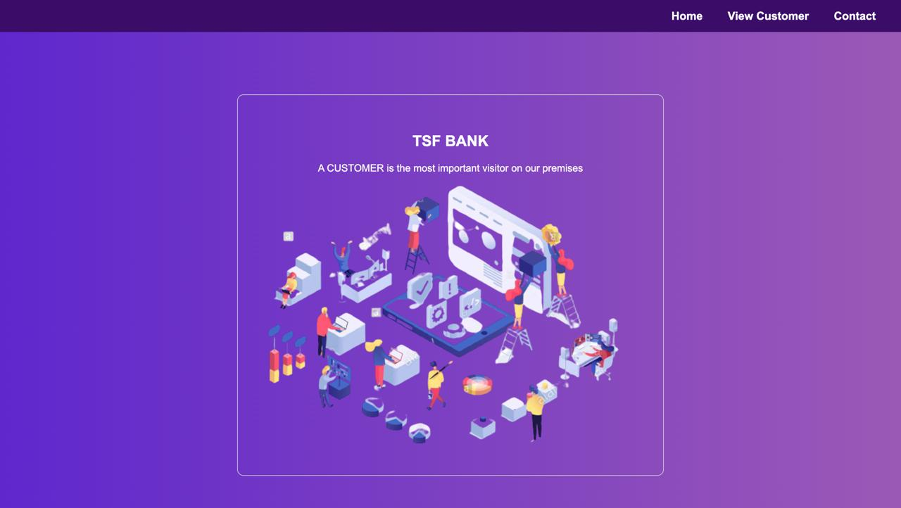

# Basic-Banking-System-

## Introduction
>  
> A web application used to transfer money between two users.

## Technologies Used:
>  ### Front-End:
- HTML
- CSS
- Bootstrap
> ### Back-End:
-  PHP 
-  MYSQL

### Flow of the website
Home > Contact Us > Customer Details > Transfer Money 

Below are the screenshots of the website

𝐂𝐥𝐢𝐜𝐤 𝐇𝐞𝐫𝐞: https://sathishvemala.github.io/Basic_Banking_System/

